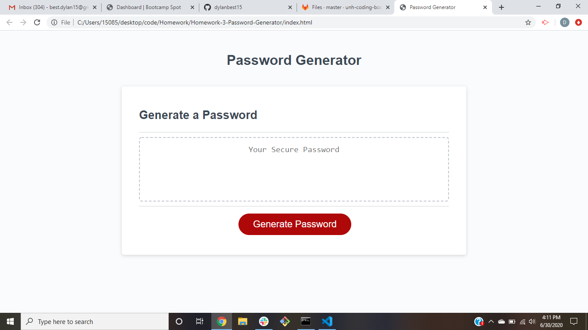

# Password-Generator
This website will randomly generate a secure password for the user. Upon pressing a button, the user will be prompted to choose the parameters of the password that they want generated. This includes how many characters long it should be, if it should contain lowercase letters, if it should contain uppercase letters, if it should contain numbers, and if it should contain special characters. The prompts will make sure that the user enters a valid criteria and then generate a password randomly that the user can copy and paste into their own secure files.

https://dylanbest15.github.io/Password-Generator/